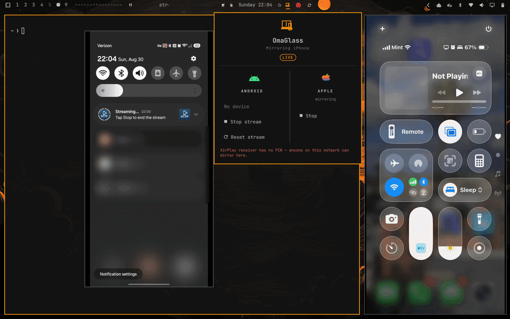
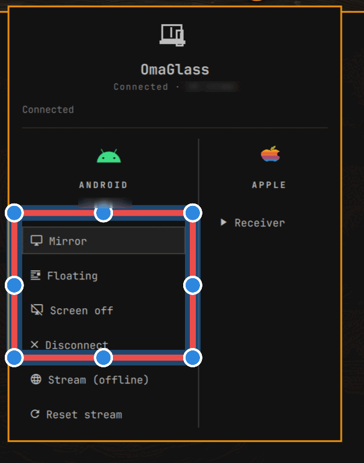

<div align="center">

<picture>
  <source media="(prefers-color-scheme: dark)" srcset="assets/omaglass-dark.svg">
  <source media="(prefers-color-scheme: light)" srcset="assets/omaglass-light.svg">
  
</picture>

# OmaGlass

**Phone as a live pane on the laptop.**

An Omarchy bar plugin that puts an Android phone or iPhone on the desktop as an
ordinary window — one you can screen-share or record like any other.

<br>


<br>



<sub>Both at once: Android over ScreenStream on the left, an iPhone over AirPlay on the right.</sub>

</div>

---

Two platforms, two transports, one outcome:

| | Android | iPhone |
|---|---|---|
| Transport | `scrcpy` over `adb` | `uxplay` (AirPlay receiver) |
| Pairing | QR code → mDNS → `adb pair` | Control Center → Screen Mirroring |
| Who initiates | the computer | the phone |
| Control | yes | no (AirPlay carries no input channel) |
| Audio | yes | yes |

Control is explicitly a non-goal. The point is a capturable window.

**Status: working plugin, both platforms.** Installs as a bar widget with an
Android column and an Apple column.

- **Android → scrcpy.** Finds the phone over mDNS with no configured address,
  following the port as it rotates, and labels it by model name.
- **iPhone → UxPlay.** Start the receiver, pick it in Control Centre. Mirrors to
  a mapped Wayland toplevel any recorder can capture.

```bash
omarchy plugin add https://github.com/labrat-0/omarchy-omaglass --enable
```

## Three ways to get a phone on screen

Pick one. Each is a one-time setup; afterwards it is two clicks.

---

### 1 · Android, no developer options

> **Nothing to enable. Nothing to pair. Nothing typed.**
> View only — no touch control, and the phone's lock screen stays black.

<table>
<tr>
<td width="200" align="center">
<br>
<sub><b>Scan with the phone's camera</b></sub>
</td>
<td>

**On the phone**
1. Install **ScreenStream** — scan the code, or
   [Play Store](https://play.google.com/store/apps/details?id=info.dvkr.screenstream)
   · [F-Droid](https://f-droid.org/packages/info.dvkr.screenstream/) (ad-free)
2. Open it and start **Local mode**

**In OmaGlass**

3. **Find phone** — sweeps the network, about two seconds
4. **Stream**

</td>
</tr>
</table>

The same QR is inside the widget under **Get the app**, so a new user never has
to leave the panel. This QR is only a URL, so the ordinary camera is the right
thing to scan it with.

---

### 2 · Android with wireless debugging

> **Full touch and keyboard control**, and the sharpest picture.
> Requires developer options — see [why](#does-android-need-debugging-just-to-look).

**On the phone**

1. **Settings → About phone → Software information**
2. Tap **Build number** seven times to unlock developer options
3. **Settings → Developer options → Wireless debugging → ON**

That is the whole setup. **No pairing code, no IP address, no port.** OmaGlass
finds the phone over mDNS and follows the port Android rotates on every toggle.

**In OmaGlass** — the Android column fills in on its own:

<p align="center">

</p>

| | |
|---|---|
| **Mirror** | normal resizable window |
| **Floating** | small window, always on top |
| **Screen off** | mirrors while the phone's own display sleeps |
| **Disconnect** | drops adb, ending mirroring and control |

---

### 3 · iPhone

> **Nothing to install or enable on the phone.**
> View only — AirPlay carries no input channel.

1. In OmaGlass, press **Receiver** under **Apple**
2. On the iPhone: **Control Centre → Screen Mirroring → Omarchy**

If the receiver appears on the phone but will not connect, the firewall is
blocking the AirPlay ports:

```bash
sudo ./bin/omaglass-firewall --apply   # run with no args to preview first
```

> [!WARNING]
> The receiver accepts **any** device on the network unless a PIN is set. Fine
> at home, not on conference or hotel Wi-Fi. Set **AirPlay PIN** in the widget's
> settings; the panel warns in red while running without one.

---

### Does Android need debugging just to look?

For **scrcpy**, yes — adb is its only transport, so wireless debugging is
required even for a view-only mirror, and full control simply comes included at
no extra step.

But scrcpy is not the only route. Android's `MediaProjection` API lets any
installed app capture the screen with a consent prompt and no developer options
at all. [ScreenStream](https://github.com/dkrivoruchko/ScreenStream) is the
mature example — on Google Play and F-Droid, serving MJPEG over HTTP on the LAN
(ad-free on F-Droid) or WebRTC via a signalling service. Point a browser or
`mpv` at the URL and you have a capturable window with no debugging enabled.

The trade is real, in both directions:

| | scrcpy | MediaProjection app |
|---|---|---|
| On the phone | enable a setting | install an app |
| Developer options | required | none |
| Control | yes | no (view only) |
| Latency / quality | low latency, native | higher latency, MJPEG is heavy |
| Lock screen | mirrors | renders black (OS restriction) |

So "Android needs debugging" is true of *this* plugin's Android path, not of
Android. A no-debugging mode is a legitimate third transport and is not yet
implemented.

### Why there is no third way

Android has no built-in screen server. Pixels leave the device by exactly one
of three routes:

| Route | Enable | Install | Control | Viable here |
|---|---|---|---|---|
| adb (scrcpy) | developer options | nothing | yes | yes — best quality |
| MediaProjection (ScreenStream) | nothing | one app | no | yes — view only |
| Miracast | nothing | nothing | no | **no** |

Miracast is the only route needing neither a setting nor an install, so it was
checked properly rather than dismissed:

- The hardware is fine — this Wi-Fi reports `P2P-client`, `P2P-GO` and
  `P2P-device`, and Samsung ships Miracast as Smart View.
- There is no maintained receiver packaged for Arch. `miraclecast-git` is the
  only AUR entry and is over 1200 days stale; `lazycast` is unpackaged and
  targets Raspberry Pi.
- A sink must claim the Wi-Fi radio as a P2P group owner. On a single-radio
  laptop that is the same radio carrying the call being screen-shared into.

GNOME Network Displays is **not** an option despite what several guides claim:
it is a Miracast *source*, casting from Linux outward, with no sink support.

So the choice is a one-time toggle or a one-time install, neither recurring.
scrcpy includes control; MediaProjection asks nothing of developer options.

QR pairing over adb was prototyped and works, but it is not the easy path
people assume: pairing by QR still requires Wireless debugging to be on. It
replaces typing an address and a code with a scan — nothing more.

**The no-developer-options path is instead made easy by finding the phone.**
The app prints its address on the phone screen; carrying that across to the
laptop is the entire friction. So the widget scans the local /24 for the
streaming port instead — about two seconds — and accepts a candidate only if
the endpoint answers with an MJPEG content type, so a router admin page on the
same port cannot masquerade as a phone. Install the app, start it, press
**Find phone**.

The iPhone is the opposite: nothing to enable, because AirPlay is a consumer
feature rather than a developer one. The widget says so in both sections rather
than leaving an empty list to imply breakage.

## Research findings

**Scope: Omarchy only.** This targets Omarchy's Quickshell bar and its
packaging, and makes no attempt to be distro-portable. Everything below was
verified on the target machine (Omarchy / Arch, Hyprland, Intel Arrow Lake-U)
unless marked otherwise.

### mDNS discovery removes the rotating-port problem

Android's wireless debugging assigns a **new connect port every time it is
toggled or the phone reboots**, which is why a saved `ip:port` goes stale. The
usual fix is adb's mDNS discovery, but Arch's `android-tools` build has it
compiled out:

```console
$ adb mdns check
adb: mdns is not supported by this version of adb.
```

The service types are still referenced inside the binary (`_adb-tls-connect._tcp`,
`_adb-tls-pairing._tcp`) — only the Bonjour backend is missing. **avahi is
already installed and running, and browses them fine:**

```console
$ avahi-browse -tpr _adb-tls-connect._tcp
=;wlan0;IPv4;adb-XXXXXXXXXXX-XXXXXX;_adb-tls-connect._tcp;local;
  Android.local;192.0.2.20;41869;"api=36.1" "name=SM-XXXXX" "v=1"
```

That yields the IP, the current port, and a human-readable device name, with no
new dependencies.

Fallback if avahi ever proves insufficient: `aur/android-sdk-platform-tools`
(Google's official prebuilt, 1300+ votes) ships adb with mDNS built in.

### The Android QR pairing flow

1. Plugin renders a QR encoding a service name and password
2. User: Wireless debugging → *Pair device with QR code* → scan
3. Phone advertises `_adb-tls-pairing._tcp`
4. Plugin discovers it via avahi → `ip:port`
5. `adb pair <ip>:<port> <password>` (this subcommand works in the packaged adb)
6. Discover `_adb-tls-connect._tcp`, connect, launch scrcpy

**Verified.** The payload is Android Studio's scheme and the pairing screen
accepts it:

```
WIFI:T:ADB;S:<service-name>;P:<password>;;
```

A phone paired from a code generated this way, and adb subsequently reported
`device` rather than `unauthorized` — only possible if pairing genuinely
completed.

**It is a Wi-Fi provisioning string.** Only the Wireless debugging scanner
interprets the `T:ADB` type field. The camera app, Google Lens, and any QR app
see `S:` as a network name and `P:` as its password, and will try to join a
network that does not exist — dropping the phone off its current Wi-Fi. This
happened during testing. Never display such a code before the pairing screen is
open.

**Connect-after-pair race — fixed.** Pairing would succeed and leave no
connection. Three causes, not one:

- the poll began while the phone was still in pairing mode, so avahi served the
  *previous* session's cached record
- `adb connect` reports success even when the device settles as `offline` or
  `unauthorized`, so a bad target looked like a good one
- the first discovered address was committed to, with no way to reconsider

Now the script waits for `_adb-tls-pairing._tcp` to disappear before looking for
a connect service, and treats any discovered address as a hypothesis: connect,
confirm `adb devices` actually reports `device`, and on failure disconnect and
re-discover rather than trusting the first record seen.

Verified against the live device, including the stale port that caused the
original failure — a real target is accepted, and both the stale port and a
bogus address are rejected. The full pair-then-connect path has not been
re-exercised since the fix; that needs another pairing run.

Prior art for rendering: Omarchy's own `plugins/panels/wifiqr` shells out to
`qrencode`, parses the matrix in `Model.js`, and draws each module as a native
`Rectangle` in a `Grid` — crisp, no temp files, no image cache races. Copy that
approach. `qrencode` 4.1.1 is already installed.

### iPhone needs no QR at all

Apple's discovery already does that job — the user taps the machine in Control
Center → Screen Mirroring. No code, no port, no pairing step. The QR idea solves
an Android-specific problem.

iOS exposes **no** API for a computer, web page, or QR code to *initiate*
mirroring, so the phone-initiated model is not a design choice; it is the only
one available. (Safari on iOS also blocks `getDisplayMedia`, ruling out a
WebRTC route.)

`scrcpy` 4.1 has no iOS support of any kind — it works by pushing a Java server
over adb, which has no iOS equivalent.

### UxPlay requirements

Declared dependencies (`openssl`, `libplist`, `avahi`, `gst-plugins-base`) are
satisfied, but they are not sufficient in practice.

**Blocker: no H.264 decoder is installed.** AirPlay mirrors as H.264, so UxPlay
would connect and display nothing:

```console
$ for e in avdec_h264 vah264dec vaapih264dec openh264dec; do ...
avdec_h264: no   vah264dec: no   vaapih264dec: no   openh264dec: no
```

`h264parse` is present, but a parser is not a decoder. Required:

- `gst-libav` — software H.264 decode (`avdec_h264`)
- `gst-plugin-va` — VA-API hardware decode; the GPU is Intel Arrow Lake-U, and
  hardware decode matters here because recording will already be competing for
  CPU

Display is fine: `waylandsink`, `glimagesink`, `gtkwaylandsink`, and
`xvimagesink` are all available under Hyprland.

### The firewall is the real blocker, and it fails deceptively

Omarchy runs `ufw` by default. mDNS (UDP 5353) is permitted, so **the receiver
appears in the iPhone's Screen Mirroring list** — everything looks correct —
while the AirPlay data ports are dropped and the connection dies before uxplay
ever sees it. The symptom is a receiver you can select but never connect to,
and a log that stops immediately after `register_dnssd`.

Compounding it: uxplay assigns its ports **dynamically** by default, so there is
no fixed set to allow. Pass `-p` to pin the legacy ports, then open exactly
those:

| Protocol | Ports |
|---|---|
| TCP | 7000, 7001, 7100 |
| UDP | 6000, 6001, 7011 |

`bin/omaglass-firewall` does this scoped to the LAN. Do not open these to
`0.0.0.0/0` — an AirPlay receiver accepts screen data from anyone who can reach
it.

Any plugin built on this must detect the case and say so, because every
surface-level signal points at success.

### Latency

scrcpy is a direct capture pipe and is very low latency. AirPlay adds a network
encode/decode round trip — expect a few hundred milliseconds. Irrelevant for
recording; visible if narrating while pointing at the physical phone.

## Security

What works for testing is not what should ship.

**UxPlay accepts any client on the network by default.** It has real access
control — `-pin`, `-pw`, and `-restrict` with `-allow <deviceID>` — and none of
it is on unless asked for. Combined with LAN-wide firewall rules, that means
anyone on the network can mirror to your screen. Acceptable on a home LAN;
not on conference or hotel Wi-Fi. A shipped plugin should default to `-pin`.

**Android wireless debugging is the larger exposure.** adb over TCP is not
screen sharing — it is full device access: install apps, read storage, record
the screen. Android 11+ requires TLS and paired keys, so it is not trivially
open, but leaving it enabled on an untrusted network is a genuine risk. A
plugin that makes it frictionless should say so rather than quietly encourage
it.

**The pairing QR displays a plaintext password.** If you are screen sharing
while pairing — precisely the use case this project serves — you broadcast it.

Firewall rules added by `bin/omaglass-firewall` are scoped to the subnet that
was current when they were applied. On a different network they will not match,
so mirroring fails closed rather than open. `bin/omaglass-doctor` detects that case.

## Why not Rust

An Omarchy bar widget's entry point is a `.qml` file loaded by Quickshell.
There is no Rust surface to target, so this is a constraint rather than a
preference.

It would not help regardless. The plugin spawns processes and parses one line
of avahi output every ten seconds; the video path is already native C/C++ in
scrcpy and GStreamer. The performance lever that does matter is hardware
decode, which is currently inactive — see the decoder note under Setup.

## Diagnosing

```bash
./bin/omaglass-doctor           # full report
./bin/omaglass-doctor --quiet   # only problems; exits 1 on a blocker
```

Every check exists because that failure was **silent** the first time:

| Failure | How it presented |
|---|---|
| No H.264 decoder | phone connects, black nothing |
| ufw blocking AirPlay | receiver visible on the phone, will not connect |
| Rotating adb port | saved address stale |
| QR scanned by the camera app | phone dropped off its Wi-Fi |
| Stale mDNS record | pairs, then no connection |

100% success is not on offer: networks, firewalls, packaging, and phone OS
behaviour are outside this project's control, and Android rotates its port by
design. The achievable target is that nothing fails *silently*, which is what
`doctor` is for.

## Setup

```bash
omarchy plugin add https://github.com/labrat-0/omarchy-omaglass --enable
```

Everything else is already on an Omarchy system except the H.264 decoder the
AirPlay path needs:

```bash
omarchy pkg add gst-libav gst-plugin-va
omarchy pkg aur add uxplay
sudo ./bin/omaglass-firewall --apply
```

Hardware decode is not active out of the box — `vah264dec` is absent despite
`gst-plugin-va`; Intel graphics want `intel-media-driver`. Software decode is
fine for a phone-sized stream, so this only matters if recording shows CPU
contention.
